# Logger Manager

An IdentityIQ plugin for turning log4j2 loggers on and off across every host in
a deployment, from the IIQ UI. No shell access, no editing `log4j2.properties`,
no restart.

**[Watch the demo](docs/logger-manager-demo.mp4)** (1m 45s) - a screen recording
that opens the plugin from the IdentityIQ header, turns a logger on across a
cluster, watches each host confirm it, finds it live in the JVM, reads the log
back from every host, and shows the change in the audit trail.

Requires IdentityIQ **8.3 or later** (JDK 11, log4j2). Developed and tested on
8.5 with Tomcat 9 and SQL Server; 8.3 and 8.4 meet the same requirements but
have not been tested here.

8.3 is the floor because that is where IdentityIQ moved to log4j2. This plugin
drives log4j2's runtime configuration API and reads log4j2's properties syntax,
neither of which exists on 8.2 and earlier - those ship log4j 1.x. If log4j2-core
cannot be reached the page says so rather than failing, so a wrong guess about a
given release degrades to a clear message.

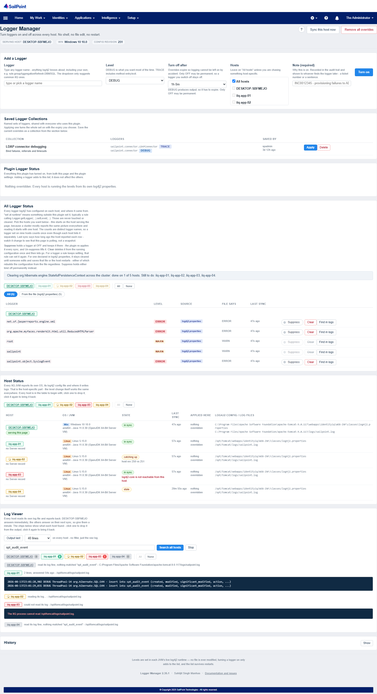

---

## Why

Raising a logger in IIQ normally means SSH to each app server, edit
`WEB-INF/classes/log4j2.properties`, and wait. In a cluster that is once per
host, with a chance to typo a level or miss a server each time, and it assumes
developers have shell access to production.

This makes it: pick a logger, pick a level, pick how long, click.

## How it works

Levels are set in each JVM's **live log4j2 runtime** - no file on any host is
modified. The desired state lives in the IIQ database, and a service on every
host reconciles against it on a timer.

```
 Browser ──REST──► the host serving it ──writes──► IIQ database
                                                        │
                        ┌───────────────────────────────┼───────────────┐
                        ▼                               ▼               ▼
                     host A                          host B          host C
              log4j2 runtime                  log4j2 runtime   log4j2 runtime
```

No host talks to another. Three things follow from that:

- **Propagation** - a change reaches every host within one interval (60s by
  default), with no host-to-host networking and no shared filesystem.
- **Durability** - a JVM that restarts re-applies the current state on its
  first tick, without anything having been written to disk.
- **Portability** - a mixed Windows, Linux, macOS and container cluster needs
  no special handling, because nothing depends on paths, permissions or a shell.

The `ServiceDefinition` ships with `hosts="global"`, which is what starts the
reconciler in every JVM.

## Install

Download the zip from the [latest release](../../releases/latest), then
**gear icon → Plugins → New** and upload it. No restart needed.

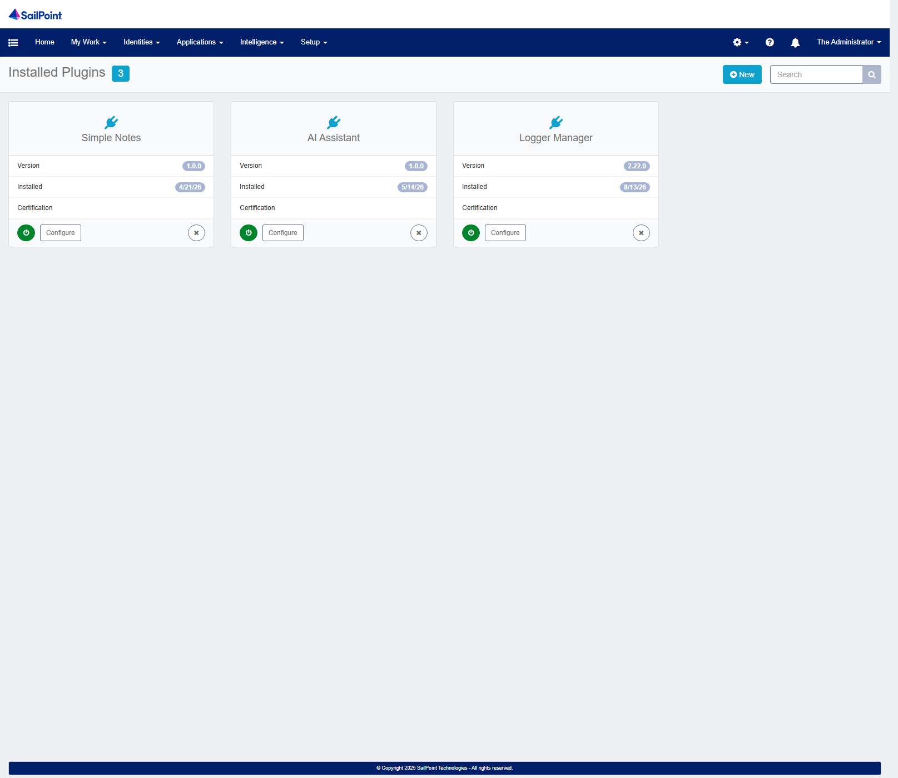

To build instead:

```bash
build.bat                                        # Windows
IIQ_LIB=/opt/identityiq/WEB-INF/lib ./build.sh   # Linux / macOS
```

Open the page at `/identityiq/plugins/pluginPage.jsf?pn=TurnOnLoggers`, or
**gear icon → Plugins → Logger Manager → Configure**, which carries a link to
it. IdentityIQ gives plugin full pages no menu entry of their own, so the
plugin adds one itself — see [The header icon](#the-header-icon) below.

Grant access by pointing `requiredCapability` at a capability of your own. The
default is `SystemAdministrator`, which works out of the box but is broader
than most people need.

## The header icon

The plugin puts one icon in IdentityIQ's top-right navigation that opens the
page, so reaching it is not a trip through **gear icon → Plugins** every time.

Two independent gates decide who is shown it, because an icon everyone can see
and only some people can use is worse than no icon at all.

**IdentityIQ decides first.** The icon's script is declared with
`rightRequired="ViewLoggerManagerIcon"`, which IdentityIQ evaluates
server-side: users who do not hold that right are never sent the script at all.
It is not hidden with CSS, and there is nothing to find in the page source.

**The plugin decides second.** For users who are sent it, the script asks
`GET /nav`, which answers `true` only if `showNavIcon` is on *and* the caller
also passes the `requiredCapability` check. A right is not a capability, so
this closes the gap where somebody holds one but not the other and would
otherwise be handed a link straight to a 403. The answer is cached per browser
session, so it costs one small request per session rather than one per page.

Members of `SystemAdministrator` are shown the icon without any setup, because
IdentityIQ treats that capability as holding every right. **For anyone else,
add the `ViewLoggerManagerIcon` right to whichever capability your logging
administrators already hold.** The right itself needs no importing: it ships in
`import/install/`, which IdentityIQ imports when the plugin is installed - so
the object exists, granted to nobody, from the moment you install. (If your
`iiq.properties` sets `plugins.importObjects=false`, that import does not
happen and the file has to be imported by hand.)

Until the right is granted, nobody outside `SystemAdministrator` sees an icon -
which is the right way round for this to fail: a plugin should not start
advertising itself in every user's header the moment it is installed.


To remove the icon for everyone without touching who holds the right, turn
`showNavIcon` off.

## Using it

### The page

| Section | What it shows |
|---|---|
| Add a Logger | The form. The logger box is free text; the dropdown only suggests common IIQ loggers. A note is required. |
| Plugin Logger Status | What this plugin is holding, and which hosts have confirmed each one. |
| All Logger Status | Every logger log4j2 has configured on each host, with its source. |
| Host Status | Each JVM's OS, log4j2 config path, log files and last sync. |
| Log Viewer | The log itself: the last N lines, or a search across every host. |
| History | What has been changed through this plugin. Collapsed until asked for. |

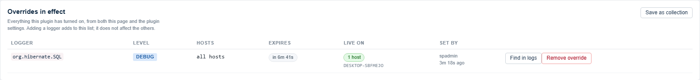

### Host chips

*All Logger Status*, *Host Status* and *Log Viewer* each draw a row of host chips. They
behave the same everywhere and carry two independent things.

**Colour is status** - how that host is doing with respect to what the section is
about. In *All Logger Status* and *Host Status* that is the host's own health:

| Chip | Meaning |
|---|---|
| green | in sync |
| amber, spinner | catching up - an older revision, applies the current one on its next sync |
| amber, no spinner | stale; reporting, but its last sync is old enough to distrust |
| grey | not reporting - IIQ lists the host but the sync service has not run there |
| red | the host reported an error of its own |

Grey rather than red for a silent host is deliberate: it is missing information,
not a fault. See [Every host state](#every-host-state) for the full list.

In *Log Viewer* there is a query to answer, so the colour is what that host found instead.

**Picked is separate from colour.** Not picked is faded and struck through, the same
in every section. What differs is only where each section starts:

| Section | Starts with |
|---|---|
| All Logger Status | the host serving the page, alone |
| Host Status | every host |
| Log Viewer | every host |

Click any chip to toggle it; pick as many as you like. **All** / **None** at the
end of the strip save clicking through twelve of them, and appear only when there
is more than one host. *All Logger Status*
starts on one host because a cluster mostly reports the same picture everywhere, so
reading it starts with one host and widens when you are comparing.

Picking several hosts there draws one table with a banner between each host's rows,
rather than a table each. Separate tables sized their columns to their own content,
so `LEVEL` landed somewhere different on every host - and comparing hosts means
reading down a column. One table computes one geometry from all the rows, stays fluid
at any width, and scrolls inside its own box rather than pushing the page sideways.

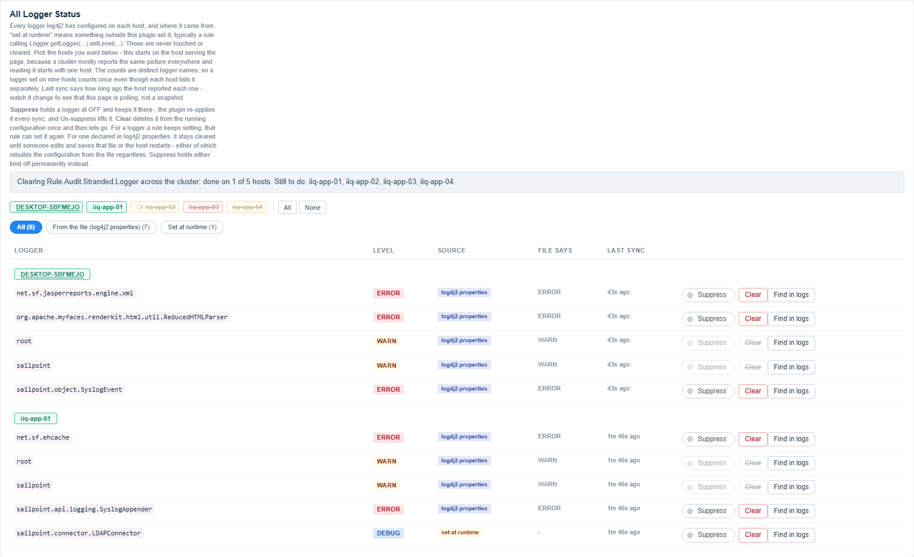

### When the source cannot be known

A logger is classified per host, from that host's own record of what this plugin
created. A rule, though, can set a logger on **any** host at any time, and not
necessarily the same one it used last time.

So if this plugin has a record of creating a logger on host A, and that same
logger is being set at runtime somewhere else in the cluster, `left over` is a
guess. The thing on A might be this plugin's litter, or it might be the rule
having fired somewhere new. Nothing in the running configuration distinguishes
them.

Those rows show **both tags** - the red `left over` chip and the amber
`set at runtime` chip, side by side - rather than picking a side. A leftover that nothing else in the cluster is setting stays a plain
`left over`, because there it really is certain.

**Clear all left over** lists any ambiguous loggers by name before you confirm,
since that is the one action that could take away logging something else is
relying on. Clearing is one-shot either way: if a rule is setting it, it returns
the next time that rule runs, and Suppress is what holds it off.

### What the filter counts mean

The number on each source filter is **distinct logger names** across the hosts
you have picked. A logger set by a rule on nine hosts counts once, not nine
times, even though each host lists it separately below.

That means the count is usually smaller than the number of rows on screen. The
difference is itself the useful bit — it says a logger is running in more than
one place — so each button's tooltip states both.

### Where a logger came from

| Source | Meaning | Cleared automatically? |
|---|---|---|
| `log4j2.properties` | Declared in that host's file | never |
| `this plugin` | An override managed here | on removal or expiry |
| `left over` | Created by this plugin, still live, and no longer managed by it | yes |
| `left over` + `set at runtime` (two chips) | Either - see below | yes |
| `set at runtime` | A rule or custom code set it | **never** |

That last row matters. A rule doing
`Logger.getLogger("Rule.X").setLevel(DEBUG)` creates a `LoggerConfig` that is
neither in the file nor this plugin's, and it is never removed automatically.

### Suppress and Clear

| | Suppress | Clear |
|---|---|---|
| The logger entry | stays, held at `OFF` | deleted |
| Enforced afterwards | yes, re-applied every sync | no |
| Survives a rule re-setting it | **yes** | no |
| Reversible | yes, click the toggle again | nothing to reverse |

**Suppress holds it; Clear deletes it and lets go.** Suppress is the right
choice for a logger a rule keeps switching back on. Clear is for tidying an
entry that should not exist and that nothing will recreate.

**A logger declared in `log4j2.properties` can be cleared too** - it stays
cleared until someone edits and saves that file, or the host restarts, either
of which rebuilds the whole configuration from the file regardless of what
Clear did. Suppress is for when you need it held off across a restart rather
than just now; the automatic "Clear all left over" sweep never touches a
file-declared logger, only Clear on a named row does.

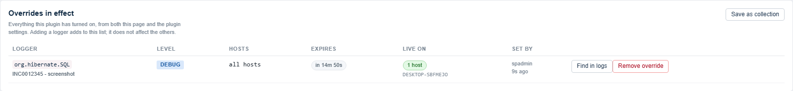

### Every override needs a note

Turning a logger on requires a note - a ticket number or a sentence. It is
recorded in the audit event and shown in the table to whoever finds the logger
later. "Who turned this on" is answerable from the audit trail afterwards;
"why" is not, unless someone was made to say so at the time.

### Saved Logger Collections

A collection is a named set of loggers and levels, **shared with everyone** who
uses the plugin. Turn the loggers on, press **Save as collection**, and the next
person chasing the same problem can turn the whole set on in one click with an
expiry of their choosing.

Each override a collection creates is noted `from collection: <name>`, so the
table and the audit trail both say where it came from.

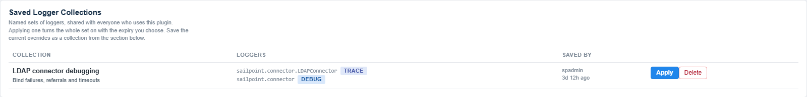

### Reading the log

Two things, both across every host:

- **Output last N lines** - the raw end of every host's log, no filter and no
  search term needed, for when a search finds nothing and you just want to see
  what a host is writing. Leaving the search box blank does the same thing.
- **Search all hosts** - lines matching some text.

**Stop** ends either. **Find in logs**, on every row of *All Logger Status*, starts a search for that logger without retyping the name.

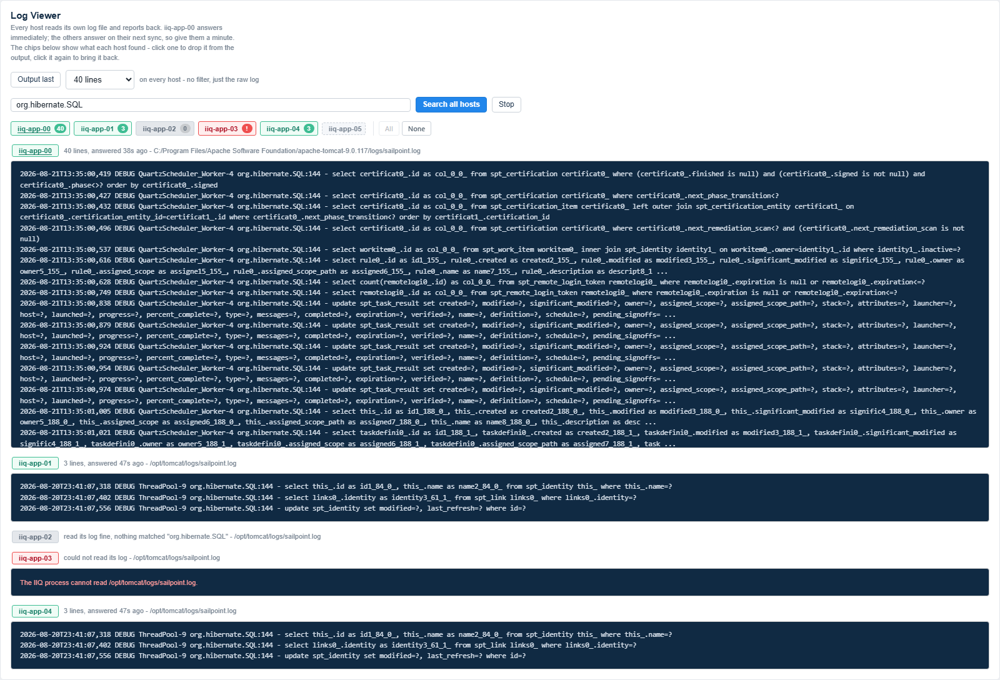

### The host chips

Every host has a chip, from the moment the panel is open. The chips carry two
independent things.

**Colour is status** - what that host did with the request:

| Chip | Meaning |
|---|---|
| grey, no count | nothing asked yet |
| amber, spinner | asked, still reading - answers on its next sync |
| green, with a count | answered, found that many lines |
| grey, with a zero | answered, read its log fine, matched nothing |
| red | could not read its log, or is not reporting |

Grey-with-a-zero is deliberately not red. On a cluster search most hosts
legitimately match nothing, and which hosts those are is usually the finding.

**Struck through is selection** - whether that host is in the output below.
Click a chip to drop it, click again to bring it back. The two are independent,
so a host that found forty lines and has been clicked out is green *and* struck
through.


The selection survives the next query: narrow the cluster down to the three
hosts you are working on once, then run a tail, then a search, then another
search. The colours keep up; the selection holds.

Only files that host's own log4j2 configuration writes to are offered, and the
request picks one **by index into that list, never by path** - so it cannot be
pointed anywhere else, and there are no OS-specific paths in it at all. Reads
are taken from the end with a seek, capped by `logTailKb` (512KB hard ceiling),
and audited. Set `showLogFiles` to `false` to remove the panel.

### Searching every host

A single search, answered by every host about its own file. Nothing is fetched
remotely - no host can read another's disk. The text is recorded once, each
host looks in its own log on its next sync and publishes what it found, and the
page merges the results with how long ago each host answered.

Bounded deliberately: up to 40 matching lines per host from the last 256KB,
long lines truncated, and the search stops being answered after fifteen
minutes. Hosts that cannot read their log say so as a red chip rather than
returning the error as though it were a line of log.

### Expiry

Overrides expire so logging cannot be left on by accident.

| Level | Expiry |
|---|---|
| `OFF` | may be permanent |
| everything else | must expire, capped by `maxTtlMinutes` |

## Settings

**gear icon → Plugins → Logger Manager → Configure.** Changes take effect on
the next read; no restart.

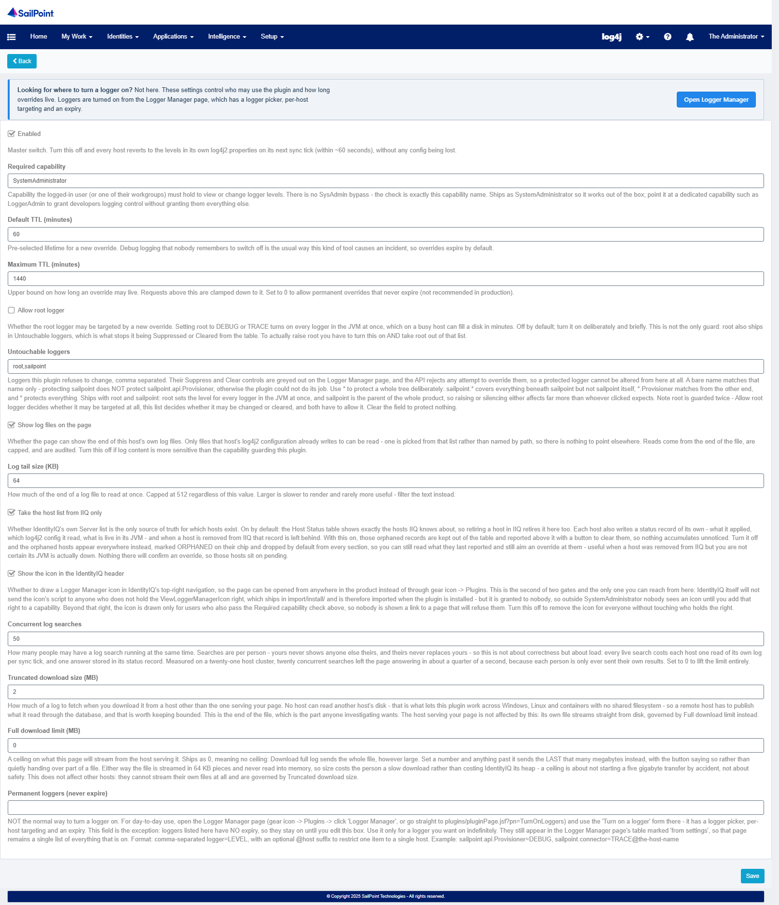

| Setting | Default | Purpose |
|---|---|---|
| `enabled` | `true` | Master switch. Off reverts every host to its own file. |
| `requiredCapability` | `SystemAdministrator` | Capability needed to use the page. No SysAdmin bypass. |
| `defaultTtlMinutes` | `60` | Preselected lifetime for a new override. |
| `maxTtlMinutes` | `1440` | Cap on lifetime. `0` allows permanent overrides at any level. |
| `allowRootLogger` | `false` | Whether the root logger may be targeted. |
| `untouchableLoggers` | `root,sailpoint` | Loggers the plugin refuses to change. |
| `permanentLoggers` | *(blank)* | Loggers enabled from the settings page, with no expiry. |
| `showLogFiles` | `true` | Whether the page can show the end of this host's log files. |
| `showNavIcon` | `true` | Whether to draw the header icon. Gated by the `ViewLoggerManagerIcon` right as well. |
| `logTailKb` | `64` | How much of the end to read. Capped at 512 regardless. |
| `hostsFromServersOnly` | `true` | Whether IdentityIQ's `Server` list is the only source of truth for which hosts exist. |

### Protecting loggers

`untouchableLoggers` greys out Suppress and Clear for those loggers and makes
the API reject them. A bare name matches **that name only, not by prefix** -
protecting `sailpoint` does not protect `sailpoint.api.Provisioner`, or the
plugin could not do its job.

Use `*` to protect a whole tree deliberately:

| Pattern | Matches | Does not match |
|---|---|---|
| `sailpoint` | `sailpoint` | `sailpoint.api.Provisioner` |
| `sailpoint.*` | `sailpoint.api.Provisioner`, `sailpoint.connector.LDAPConnector` | `sailpoint`, `org.hibernate.SQL` |
| `*.Provisioner` | `sailpoint.api.Provisioner` | `sailpoint.api.Provisioners` |
| `*` | everything | - |

Matching is case-insensitive and `*` spans dots. Everything else is literal, so
a logger name containing regex characters is treated as text. The page and the
API use the same rules, and the build fails if they ever disagree.

When a pattern refuses something, the message names the pattern that did it -
`sailpoint.api.Provisioner is protected by the pattern 'sailpoint.*'` - rather
than leaving you to work out which entry matched.

### root is guarded twice

`allowRootLogger` and `untouchableLoggers` overlap on `root`, and they are not
redundant. They cover different actions:

| | Add or change an override | Suppress / Clear from the table |
|---|---|---|
| `allowRootLogger` = `false` | blocks root | no effect |
| `root` in `untouchableLoggers` | blocks root | blocks root |

Root is blocked if **either** blocks it, and `allowRootLogger` is checked first,
so that is the message you see. To actually raise root you have to turn
`allowRootLogger` on **and** take `root` out of `untouchableLoggers`. Turning
the switch on by itself changes nothing except which refusal you get, so that
second refusal now says so.

`permanentLoggers` takes comma-separated `logger=LEVEL`, with an optional
`@host` suffix to restrict one item to a single host:

```
sailpoint.api.Provisioner=DEBUG, sailpoint.connector=TRACE@iiq-app-02
```

## Audit

Every action writes an IIQ audit event under the action `LoggerManagerChange`:
who, what happened, the logger, level, target hosts, expiry, and the note from
the form.

There is no switch for this, and events are written whatever Audit
Configuration says. Changing what a production system logs is privileged, so
whether it gets recorded is not left to the person making the change.

To find them: **Advanced Analytics → Search Type: Audit → Refine Search →
Action = `Logger Manager change`**. Filtering by Source needs your IIQ *login*
name, not the display name shown in the header.

The page's own ten-second background refresh is not audited.

## Security

- Capability gated, with no SysAdmin bypass.
- Overrides expire by default.
- The root logger is blocked unless deliberately enabled.
- Protected loggers are refused by the API, not merely greyed out in the UI.
- Every change is attributable and audited.

## REST API

Base `/identityiq/plugin/rest/TurnOnLoggers`. All calls need the configured
capability; mutating calls need an `X-XSRF-TOKEN` header.

| Method | Path | Purpose |
|---|---|---|
| `GET` | `/state` | Everything the page renders |
| `GET` | `/nav` | Whether to draw the header icon for the caller. Always 200 |
| `POST` | `/entries` | Add or replace an override |
| `PUT` | `/entries/{id}` | Change level, TTL or hosts |
| `DELETE` | `/entries/{id}` | Remove one override |
| `DELETE` | `/entries` | Remove all overrides |
| `DELETE` | `/entries?expiredOnly=true` | Remove only the expired ones |
| `POST` | `/sync` | Reconcile the host serving the request |
| `POST` | `/collections` | Save the current overrides, or a given list, under a name |
| `POST` | `/collections/{id}/apply` | Turn a whole collection on |
| `DELETE` | `/collections/{id}` | Delete a collection |
| `GET` | `/logtail?index=N&kb=K` | The end of one of this host's log files |
| `POST` | `/logquery` | Start or stop a cluster-wide log search |
| `POST` | `/cleanup` | Clear left-over loggers, or one named logger |
| `GET` | `/history?limit=N&kind=change\|all` | Changes read back from the audit trail |
| `DELETE` | `/hosts/{host}` | Forget one host's status record |
| `DELETE` | `/hosts?orphans=true` | Forget the status records of every host IIQ no longer lists |

```bash
curl -u user:pass -H 'X-XSRF-TOKEN: t' -H 'Content-Type: application/json' \
  -d '{"logger":"sailpoint.api.Provisioner","level":"DEBUG","ttlMinutes":30}' \
  https://iiq.example.com/identityiq/plugin/rest/TurnOnLoggers/entries
```


## History

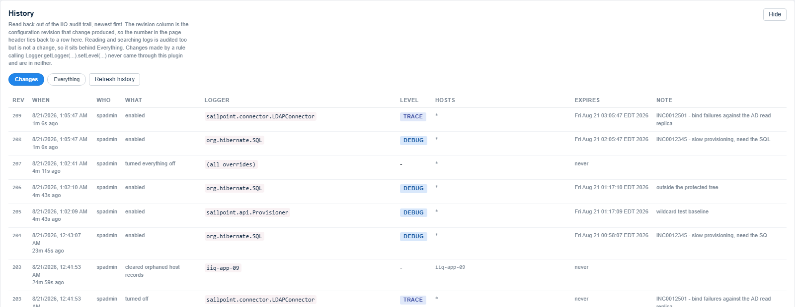

Collapsed until you press **Show** — it is a look-back, not something you need in
front of you while working, so it is not fetched until you open it and not
re-fetched by the page's refresh.

The **Rev** column is the configuration revision that change produced. That is
what makes the counter in the page header mean anything: `revision 131` on its own
only tells hosts whether they are up to date, but matched against a row here it
tells you what happened.

**Changes** is the default. Reading and searching logs is audited too — deliberately,
someone read production logs — but those are not changes, and an afternoon of
searching would bury the one override you are looking for. **Everything** includes them.

This reads straight out of the IIQ audit trail. There is no second copy kept for the
page's convenience, so what you see here is what an auditor sees in **Audit Search**
under the `Logger Manager change` action, and it survives the plugin being uninstalled.
It also inherits the trail's blind spot: a rule calling
`Logger.getLogger(...).setLevel(...)` never came through this plugin, so it is not
here — *All Logger Status* is where those show up, tagged `set at runtime`.

## Where state lives

| Object | Written by | Contents |
|---|---|---|
| `Custom "TurnOnLoggers Configuration"` | the REST layer | Desired state and a revision counter |
| `Custom "TurnOnLoggers Status <host>"` | that host's service | What the host applied, plus its OS and log4j2 facts |

One writer per object, so there is no lock contention and no lost updates
however large the cluster. Both are plain `Custom` objects, readable from the
debug page.

### Every host state

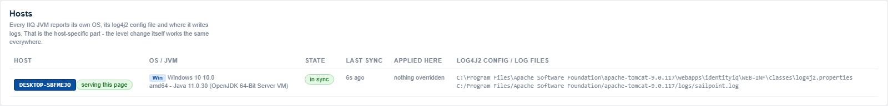

| State | Colour | What it means | What to do |
|---|---|---|---|
| `in sync` | green | Reporting, at the current revision, synced within the last 2.5 minutes | Nothing |
| `catching up` | amber, spinner | Reporting, but still on an older revision. Shows `host rev N vs M` | Wait one sync tick (~60s) |
| `stale` | amber | Reporting, at the right revision, but has not checked in for over 2.5 minutes | Check that host's `Servicer` is running |
| `not reporting` | grey | IIQ lists the host, but its sync service has never run here | Normal during rollout; otherwise check the plugin is active on that host |
| *inactive* | grey | Marked inactive in IIQ and not reporting | Nothing, unless you expected it to be live |
| error | red | The host itself reported a problem, e.g. `log4j2-core is not reachable` | Read the message; it came from that host |

Grey is deliberately not red. IIQ lists every `Server` it has ever seen,
including hosts decommissioned years ago, and a cluster mid-rollout would
otherwise look like a cluster on fire. Red is reserved for a host that actually
reported a fault.

### Which hosts exist

IdentityIQ's own `Server` list decides. Its heartbeat creates a `Server` the
moment a JVM starts, and recreates one if you delete it while that JVM is still
running, so retiring a host in IIQ retires it here too and there is no second
list to keep in step.

The status record is a separate thing: it holds what IIQ cannot tell you - what
that host applied, which `log4j2.properties` it read, what is live in its
`LoggerContext`. It belongs to this plugin and nothing garbage-collects it, so
when a host leaves IIQ its record is left behind.

What happens to those records is the one thing `hostsFromServersOnly` controls.

**On (default) — they are records, not hosts.** They stay out of the Host Status
table and are reported in one line above it, with a button on the right to
delete them, so plugin data cannot quietly accumulate in a database no screen
can reach.

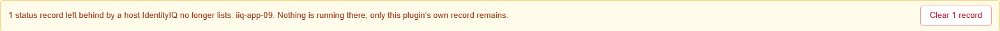

**Off — they are hosts again, clearly marked.** Every place the plugin draws a
host chip, an orphan carries an amber `ORPHANED` badge. Otherwise it behaves
like any other host: it is selected to begin with, you can read what it last
reported, see the loggers it had live, and aim an override at it. Click its chip
to drop it, the same as any other host.

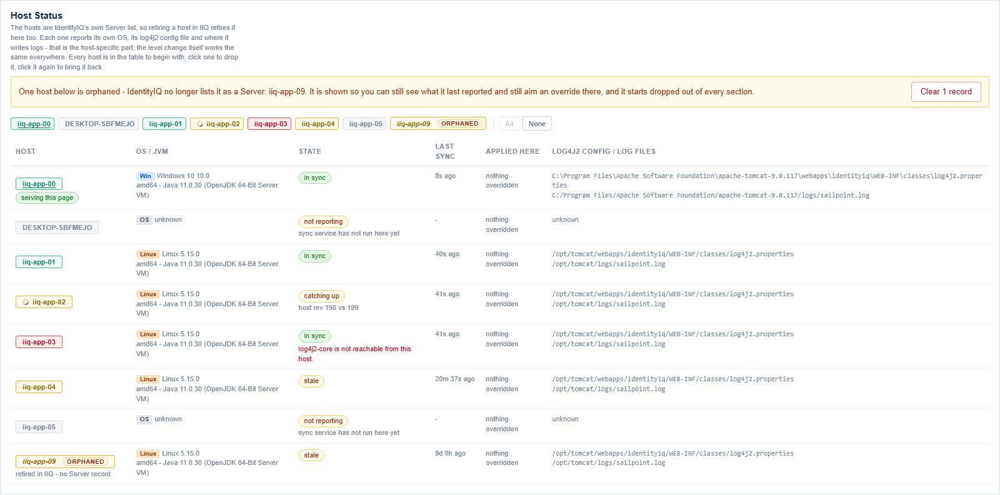

That is the mode to use when a host was removed from IIQ but you are not certain
its JVM is actually down — the one case where a logger really could still be on
somewhere you can no longer see. Nothing there will confirm an override, so
those hosts sit on `pending` indefinitely; that is the signal, not a bug.

Deleting removes only this plugin's own record of what those hosts last
reported. It does not touch IdentityIQ, and it cannot affect anything that is
running, since by definition none of them are in IIQ's `Server` list. The action
is audited like any other change.

Set `hostsFromServersOnly` to `false` to go back to listing any host that has a
status record, whether or not IIQ still knows about it. If IIQ cannot return a
`Server` list at all, the plugin falls back to that behaviour on its own rather
than showing an empty table.

## Upgrading and rolling back

**Upgrading to 2.39.0 or later from an earlier release:** the Java package moved
from `com.example.turnonloggers` to `io.github.sahiljitsinghmanhas.loggermanager`.
The `ServiceDefinition` names its executor as a string, and IdentityIQ imports
`import/install/` on install but not on upgrade, so after an upgrade it still
points at the old class. The plugin corrects
it the first time anyone opens the page - no manual step - but until something
opens the page, hosts will fail to start the sync service on their next restart.
Open the page once after upgrading and you are done.


Upload the newer zip - no uninstall, and settings are preserved. Press
**Ctrl+F5** afterwards: IIQ's plugin asset URLs do not change between installs,
so browsers serve the old JavaScript.

IIQ refuses to install an older version over a newer one, or to reinstall the
same version:

```
HTTP 400  The installed plugin does not meet the minimum upgradable version requirements.
```

Rolling back therefore means uninstalling first, which resets plugin settings
to defaults. Logger overrides live in the `Custom` object and survive.

## Troubleshooting

### One host is permanently stale, and its heartbeat is fine

Almost always this host is not running the sync service, rather than failing at
it. `hosts="global"` on the `ServiceDefinition` is an offer, not a guarantee:
**gear icon → Global Settings → Host Configuration** lets a deployment say, per
host, either the only services it runs or the ones it must not, and a host with
an include list that does not name `TurnOnLoggersSync` will never run it.
Deployments that separate UI hosts from task hosts do this routinely.

The giveaways are exact:

- the host's IIQ heartbeat is current, because that is a different service
- doing anything from the page — even reading the log — brings it back into
  sync for one interval, because that runs on the request thread rather than on
  a tick, and then it decays again
- no error appears anywhere, because nothing is failing

Where a host **explicitly excludes** `TurnOnLoggersSync` and is not keeping up,
the plugin says so — **service not enabled here** rather than *stale*, since
that is a setting and not a fault. It reports nothing about a host that is in
sync, whatever any list says: the observed behaviour is first-hand and the
configuration is not.

**Nothing here needs configuring for the plugin to work.** A `ServiceDefinition`
with `hosts="global"` runs everywhere by default, and the ordinary case is that
every host reports *in sync* with no host configuration at all.


| Symptom | Cause |
|---|---|
| A host says *not reporting* | Its sync service has not run. Check that host's `sailpoint.log` for `Unable to install service`. |
| A host says *catching up* | It is behind the current revision. Normal for up to one interval. |
| Level changed, nothing in the log | The record still has to reach an appender. On a stock IIQ the file appender is commented out and everything goes to stdout. |
| A logger is noisy and nobody set it | Read the Source column. *differs from file* means something changed it at runtime. |
| The page does not load after an upgrade | Cached JavaScript. Ctrl+F5. |

## A logger can always be turned off again

The failure worth designing against is a logger that keeps being applied but can
no longer be reached from the UI - on all night, filling a disk, with no way to
stop it short of uninstalling the plugin.

It cannot happen, and that is tested rather than asserted. The worst case was
reproduced deliberately: turn a logger on, uninstall the plugin, delete both of
its `Custom` objects so no record of the logger survives anywhere, then
reinstall. The logger is still live in the JVM and the plugin has never heard of
it. It then:

- **stays visible** in *All Logger Status*, honestly labelled `set at runtime`,
  because that section reads log4j2's live configuration rather than the
  plugin's records
- can be **suppressed** - the plugin takes ownership and holds it at `OFF`
- can be **cleared** - removed from the running configuration outright

The reason is that nothing here is inferred from the plugin's own bookkeeping.
Every row in *All Logger Status* comes from asking log4j2 what it currently has
configured, so a logger the plugin has forgotten is still a logger the page can
see and act on. Losing the records costs you the label, not the control.

## Limitations

- **Appenders are not managed**, only levels.
- **Uninstalling leaves the objects from `import/install/` behind**, because
  IIQ imports them on install but has no uninstall-time counterpart. Remove
  them with `iiq console` → `delete ServiceDefinition TurnOnLoggersSync` and
  `delete SPRight ViewLoggerManagerIcon`. Leaving the `ServiceDefinition` makes
  every host log a `ClassNotFoundException` once per Servicer cycle; leaving
  the `SPRight` is harmless but untidy.
- **Only the properties format** of log4j2 configuration is parsed. For XML or
  YAML the source of each logger cannot be determined, and the page says so.
- **Overrides live in the IIQ database**, so a database refresh carries them
  between environments.

## Help

The in-product help page explains every section, button and label. It is at
`/identityiq/plugin/TurnOnLoggers/ui/help.html`, or the **?** button on the
page itself.

## Building from source

`build.sh` or `build.bat` is all you need. Set `IIQ_LIB` to your IdentityIQ
`WEB-INF/lib` folder if it is not at the default path.

Before packaging, the build runs `tools/render-check.js` under `jjs`, which
executes `ui/js/turnOnLoggers.js` against a stub DOM and a set of state
fixtures - once as the plugin page, once as the Configure page. If the page
would not render, the build aborts rather than producing a zip that installs
and then shows nothing. It exists because a single unescaped apostrophe once
shipped in three consecutive releases.

The screenshots in `docs/screenshots/` are captured by a separate maintainer
tool that takes admin credentials, so it lives in a private repository. The
build copies that folder into `ui/img/` so the help page shipped inside the
plugin always matches the README.

The plugin settings form and IIQ's audit search are client-side apps that do
not populate from a directly-navigated URL, so those two screens are described
in words rather than captured.

## Contributing

Pull requests run a set of gates in GitHub Actions, and they have to pass before
a change can be merged. Everything they check can be run locally first:

```bash
jjs tools/render-check.js -- ui/js/turnOnLoggers.js     tools/state-fixture.json tools/state-fixture-logs.json   # the page renders
jjs tools/glob-check.js   -- ui/js/turnOnLoggers.js          # matcher, page side
jjs tools/nav-check.js    -- ui/js/snippets/header.js        # header icon
```

`jjs` ships with JDK 11 and is gone from JDK 15 onwards, so the gates pin 11 —
the same engine `build.bat` and `build.sh` use.

CI also checks that the manifest and shipped objects are well-formed, that every
image and help-page anchor referenced actually exists, that no environment
hostnames or employer names are present, and — on any pull request touching
`src/`, `ui/`, `manifest.xml` or `import/` — that `version` in `manifest.xml`
moved.

**One gate cannot run on a hosted runner.** Compiling the Java needs
`identityiq.jar`, which is SailPoint's and is not redistributable, so the
compile and `tools/GlobTest.java` run only where that jar exists: a self-hosted
runner with the `IIQ_LIB` repository variable set, or a maintainer running
`build.bat` / `build.sh` before a release. The job says so in its output rather
than passing quietly. The *page* side of the same matcher is covered on every
run, so a change that makes the two halves disagree is still caught.

## Author

Built and maintained by **Sahiljit Singh Manhas**
([@sahiljitsinghmanhas-netizen](https://github.com/sahiljitsinghmanhas-netizen)).

Issues and pull requests are welcome.

## License

[MIT](LICENSE).

SailPoint and IdentityIQ are trademarks of SailPoint Technologies, Inc. This is
an independent plugin, not affiliated with or supported by SailPoint.
